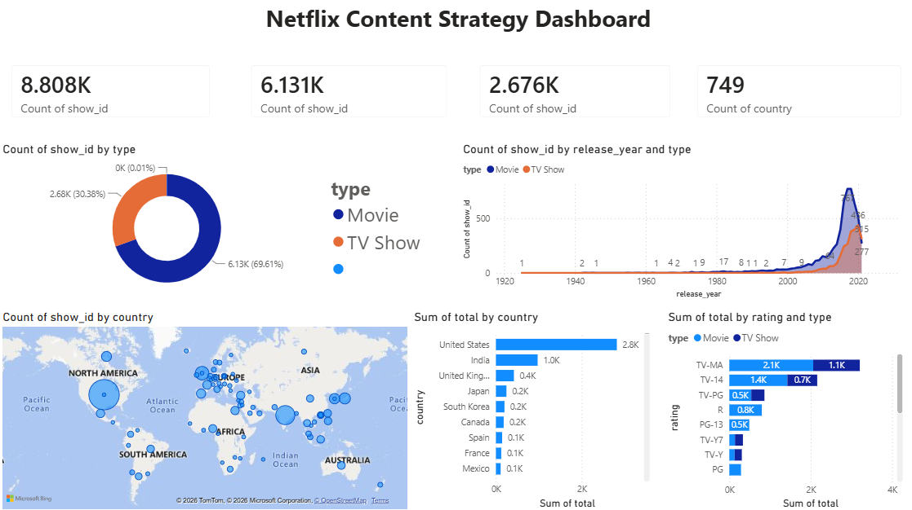

# Netflix-Data-Analytics-SQL-PowerBI

## Project Objective
To analyze Netflix’s content library using **SQL** and **Power BI**, uncovering trends in content production, genre popularity, and regional focus to help the content acquisition team make data-driven decisions.

## Business Problem
Netflix spends billions on original content. Without analyzing the existing library, the company risks over-investing in saturated genres or under-serving fast-growing markets. This project identifies exactly where Netflix should focus next.

## Tech Stack
- **Python (SQLite)** – Data loading, cleaning, and querying.
- **SQL** – Exploratory Data Analysis (CTEs, Window Functions, Aggregations).
- **Power BI** – Interactive dashboard & visualization.
- **GitHub** – Version control and portfolio hosting.

## Dashboard Features
- **KPI Cards**: Total Titles (8.8K), Movies (6.1K), TV Shows (2.6K), Total Countries.
- **Donut Chart**: Movies vs. TV Shows distribution (70% / 30%).
- **Line Chart**: Content addition trends over time (Peak in 2018).
- **Bar Charts**: Top 10 Content Producing Countries & Top Directors.
- **Heatmap (Matrix)**: Genre popularity across different release years.
- **Slicers**: Interactive filters for Type (Movie/TV Show) and Rating.

## Key Insights (From SQL Analysis)
1.  **Market Dominance**: The **United States** produces 2,818 titles, followed by **India** with 972 titles. India is Netflix’s second-largest content partner.
2.  **Content Mix**: Movies (69.6%) heavily outweigh TV Shows (30.4%), indicating a stronger focus on feature films.
3.  **Audience Targeting**: **TV-MA** is the most common rating for both Movies (2,062) and TV Shows (1,145), showing a skew toward mature/adult audiences.
4.  **Data Quality Alert**: ~30% of titles are missing a director (2,634 rows) and ~9% are missing a country. Any top-director analysis must account for this blind spot.
5.  **Trend Correction**: Contrary to popular assumption, "Documentaries" and "Stand-Up Comedy" are actually *declining* (2019: 33, 2020: 23, 2021: 20). ***(Note: 2021 data is partial, but the trend does not show growth).***
6.  **Duration**: The average Netflix movie runs ~99.6 minutes (~1h 40m), while the average TV Show lasts only ~1.76 seasons (indicating most shows don't get renewed beyond 2 seasons).

## Actionable Recommendations (For the Business)
1.  **Invest Heavily in India**: Since India is the #2 producer, Netflix should increase localized marketing and partner with top Bollywood/Tollywood directors to capture the massive untapped Indian subscriber base.
2.  **Capitalize on Short-Form Drama**: With an average movie length of 100 minutes, Netflix should prioritize acquiring **90-110 minute dramas**, as these have higher completion rates than longer epics.
3.  **Improve Data Governance**: The high rate of missing "Director" and "Country" metadata should be flagged to the catalog team to ensure future content uploads are complete.

## Repository Contents
## 📁 Repository Contents

| File | Description |
| :--- | :--- |
| `netflix.ipynb` | Jupyter Notebook with SQLite setup and all SQL queries. |
| `netflix_dashboard.pbix` | The complete Power BI dashboard file. |
| `netflix_dashboard.png` | Static screenshot of the dashboard. |
| `netflix_cleaned.csv` | Full cleaned dataset (raw rows, one per title). |
| `country_breakdown.csv` | Aggregated count of titles by country. |
| `genre_trend.csv` | Aggregated count of titles by year and genre combination. |
| `rating_by_type.csv` | Aggregated count of titles by rating and content type (Movie/TV Show). |

